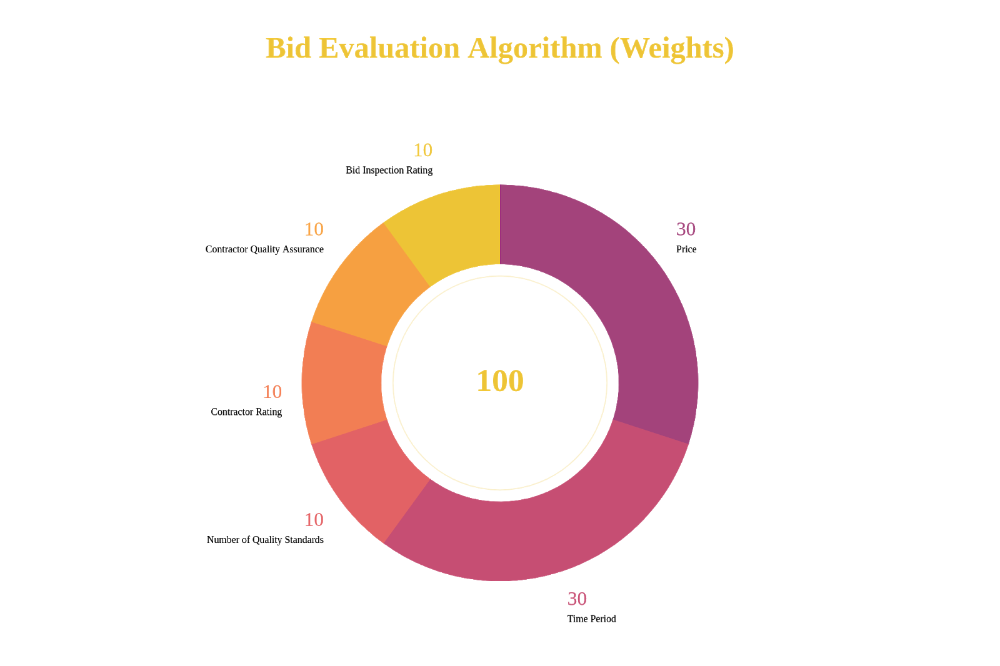
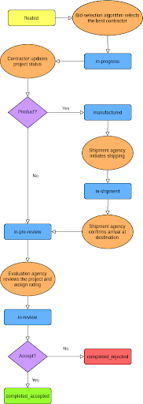
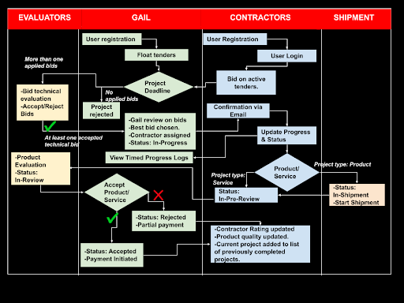

# SIH'20 Blockchain GAIL
# BUILD INSTRUCTIONS

* **fabric** contains code for the Hyperledger Fabric blockchain network and chaincode (smart contracts).
* **nodeserver** contains the NodeJS and Express backend server code.
* **GAIL_client** contains the GAIL client website code.
* **Contractor_client** contains the Contractor client website code.

---

### Setting up dependencies

> Make sure all the required folders are removed while doing `./network.sh down`. If you are facing permission errors while removing the blockchain network, use `sudo chown -R $USER:$USER test-network`.

```shell
curl -sSL https://bit.ly/2ysbOFE | bash -s
```

---

### Running the test network

> If you see this message: `WARNING: Connection pool is full, discarding connection: localhost`. That's because the python library `requests` maintains a pool of HTTP connections that the docker library uses. If we use docker-compose with more than 10 containers, this warning will occur. Solution is to change the `DEFAULT_POOLSIZE` of requests library in `~/.local/lib/python*.*/site-packages/requests/adapters.py` to `1000`.

```shell
# Install the required dependencies
./install.sh

# Deploy the blockchain network
fabric/test-network/network.sh up -ca

# Create all required channels between the peer nodes (between every pair of gail and contractor and other among all gail nodes)
fabric/test-network/network.sh createChannel

# Deploy chaincode to the channel created
fabric/test-network/network.sh deployCC

# Remove the blockchain network
fabric/test-network/network.sh down
```

OR

```shell
# Install the required dependencies
./install.sh

# Create the blockchain network
./restart.sh
```

---

### Running NodeJS backend server

```shell
# Install all the required dependencies
npm install

# Start the node server
npm start

# Open localhost:3000 in web browser
```

---

### Running NodeJS GAIL Client server

```shell
# Install all the required dependencies
npm install

# Start the node server
PORT=8000 node app.js

# Open localhost:3600 in web browser
```

---

### Running NodeJS Contractor Client server

```shell
# Install all the required dependencies
npm install

# Start the node server
node app.js

# Open localhost:4200 in web browser
```
---
---


# GAIL-BK225-Chaincode-Documentation

# Gail and Evaluators


1. Users

<table>
  <tr>
   <td>
<strong>Functions</strong>
   </td>
   <td><strong>Description</strong>
   </td>
  </tr>
  <tr>
   <td><strong>Create User</strong>
   </td>
   <td>Params: Model fields.
<ul>

<li>Username

<li>Password

<li>Email

<li>Address

<li>Profile Picture

<li>Team Name

<li>Designation: Gail User/Evaluator

<p>
Function: Saved as USER_&lt;Username> in blockchain db
<p>
Return: Void
</li>
</ul>
   </td>
  </tr>
  <tr>
   <td><strong>Get User</strong>
   </td>
   <td>Params: Username, Password
<p>
Return: JSON user data model with all fields
   </td>
  </tr>
  <tr>
   <td><strong>Get Num Contractors</strong>
   </td>
   <td>Params: Void \
Return: Number of Contractor/Shipping Agencies registered.
   </td>
  </tr>
  <tr>
   <td><strong>Update Num Contractors</strong>
   </td>
   <td>Params: Void \
Function: Increments number of Contractors/Shipping Agencies registered by 1. \
Return: Void
   </td>
  </tr>
</table>


2. Project

<table>
  <tr>
   <td>
<strong>Functions</strong>
   </td>
   <td><strong>Description</strong>
   </td>
  </tr>
  <tr>
   <td><strong>Create Project</strong>
   </td>
   <td>Params: Model fields
<ul>

<li>Username

<li>ProjectID: Automatic unique ID generated equal to number of projects registered by GAIL till now.

<li>Title

<li>Description

<li>Create Time Stamp

<li>Deadline: After the deadline is met, GAIL will be able to review all the applied bids and add it’s custom reviews.

<li>ContractorID: Initially NULL, later equal to assigned contractor

<li>BidID: Initially NULL, later equal to best evaluated bid

<li>Status: Floated/In-Progress/In-Shipment/In-Pre-Review/In-Review

<li>Progress: Array of descriptive timed logs

<li>Brochure: Uploaded in form of PDF

<p>
Function: Saved Model as PROJECT_&lt;ProjectID> in blockchain db
<p>
Return: Void
</li>
</ul>
   </td>
  </tr>
  <tr>
   <td><strong>Get Project</strong>
   </td>
   <td>Params: ProjectID
<p>
Return: JSON project data model with all fields
   </td>
  </tr>
  <tr>
   <td><strong>Get Num Projects</strong>
   </td>
   <td>Params: Void \
Return: Number of Projects registered by GAIL till now
   </td>
  </tr>
  <tr>
   <td><strong>Update Num Projects</strong>
   </td>
   <td>Params: Void \
Function: Increments number of Projects by 1 \
Return: Void
   </td>
  </tr>
  <tr>
   <td><strong>Update Project BidID</strong>
   </td>
   <td>Params: ProjectID, bidID \
Function: Updates field ‘bidID’ for project of &lt;ProjectID> \
Return: Void
   </td>
  </tr>
  <tr>
   <td><strong>Update Project ContractorID</strong>
   </td>
   <td>Params: ProjectID, contractorID \
Function: Updates field ‘contractorID’ for project of &lt;ProjectID> \
Return: Void
   </td>
  </tr>
  <tr>
   <td><strong>Update Project Progress</strong>
   </td>
   <td>Params: ProjectID, description, timestamp \
Function: Updates field ‘progress’ for project of &lt;ProjectID> as pushes JSON field having description and timestamp into the progress array. \
Return: Void
   </td>
  </tr>
  <tr>
   <td><strong>Update Project Status</strong>
   </td>
   <td>Params: ProjectID, status \
Function: Updates field ‘status’ for project of &lt;ProjectID> \
Return: Void
   </td>
  </tr>
</table>


3. Bid

<table>
  <tr>
   <td>
<strong>Functions</strong>
   </td>
   <td><strong>Description</strong>
   </td>
  </tr>
  <tr>
   <td><strong>Apply for Project</strong>
   </td>
   <td>Params: Model fields.
<ul>

<li>Username

<li>ProjectID

<li>BidID: AutoGenerated Unique ID generated by currentTimeStamp of application

<li>BidDetails: JSON of various params like price, ISO standards, rating,  product quality. (more can be added as per requirement)

<p>
Function: 
<ul>

<li>Saved as BID_&lt;BidID> in blockchain db

<li>Pushed to APPLIED_&lt;ProjectID> array of all applied bids of the given project in the blockchain dc.

<p>
Return: Void
</li>
</ul>
</li>
</ul>
   </td>
  </tr>
  <tr>
   <td><strong>Get Bid</strong>
   </td>
   <td>Params: BidID
<p>
Return: JSON bid data model with all fields
   </td>
  </tr>
  <tr>
   <td><strong>Get ProjectBids</strong>
   </td>
   <td>Params: ProjectID \
Return: Array of all the applied bids for given projectID.
   </td>
  </tr>
</table>


# Contractors and Shipping Agency


1. Users

<table>
  <tr>
   <td>
<strong>Functions</strong>
   </td>
   <td><strong>Description</strong>
   </td>
  </tr>
  <tr>
   <td><strong>Create User</strong>
   </td>
   <td>Params: Model fields.
<ul>

<li>Username

<li>Password

<li>Email

<li>Address

<li>Contact

<li>AboutUs

<li>ProfilePic

<li>ListOfPrevious Projects: Array of JSON of all previous allocated projects to the contractor by GAIL by params like ID, rating, quality, review.

<li>ActiveProjectID: NULL if no active project, otherwise equal to the projectID assigned to the contractor

<li>ActiveBidID: NULL if no active project, otherwise equal to the BidID that the contractor had applied for the allocated project.

<li>OverallRating: Average rating provided to the contractor based on past deals with GAIL

<li>OverallProductQuality: Average product/service quality provided to the contractor based on past deals with GAIL

<p>
Function: Saved as CONTRACTOR_&lt;Username> in blockchain db
<p>
Return: Void
</li>
</ul>
   </td>
  </tr>
  <tr>
   <td><strong>Allocate Project</strong>
   </td>
   <td>Params: ProjectID, BidID \
Function: Changes fields ‘activeProjectID’ from NULL to &lt;ProjectID> and ‘activeBidID’ from NULL to &lt;BidID> \
Return: Void
   </td>
  </tr>
  <tr>
   <td><strong>Dellocate Project</strong>
   </td>
   <td>Params: Username, Rating, Quality, Review \
Function: 
<ul>

<li>Changes fields ‘activeProjectID’ to NULL and ‘activeBidID’ to NULL

<li>Added JSON of id, current rating,quality,review in array of list of previous projects.

<p>
Return: Void
</li>
</ul>
   </td>
  </tr>
  <tr>
   <td><strong>Get Num of Previous Projects</strong>
   </td>
   <td>Params: Void \
Function: Returns length of the array of previous projects in the project data model. \
Return: Void
   </td>
  </tr>
  <tr>
   <td><strong>Get/Update functions </strong>
   </td>
   <td>Params: Void(GET), &lt;value>(UPDATE)
<p>
Function: Query to blockchain db to fetch or put updated state accordingly.
   </td>
  </tr>
</table>





# Project Lifecycle





# DOMESTIC USE CASE




